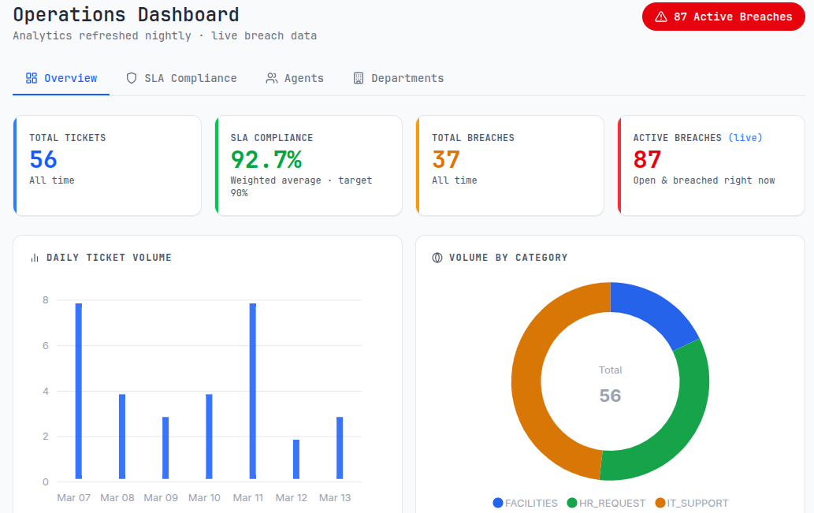

# ServiceHub

ServiceHub is an internal service request and ticket management platform for handling requests across IT, HR, and Facilities. It combines a Spring Boot backend, Thymeleaf web interface, PostgreSQL persistence, SLA tracking, automated routing, and QA/data-engineering support inside a single repository.



## What the project does

- Employees submit service requests in one of the supported categories: `IT_SUPPORT`, `HR_REQUEST`, or `FACILITIES`.
- Requests are prioritized with `LOW`, `MEDIUM`, `HIGH`, or `CRITICAL` urgency levels.
- Tickets follow a controlled workflow: `OPEN -> ASSIGNED -> IN_PROGRESS -> RESOLVED -> CLOSED`.
- Requests are routed to the correct department automatically and can be auto-assigned to the least-loaded agent.
- SLA deadlines are calculated per category and priority, with breach detection and notification support.
- Admin and user dashboards expose request volume, SLA compliance, and resolution metrics.
- The app provides both REST APIs and Thymeleaf-rendered pages for day-to-day usage.

## Monorepo structure

```text
.
|- backend/             Spring Boot application, Thymeleaf UI, Liquibase migrations
|- qa/api-tests/        REST Assured API test suite
|- qa/ui-tests/         Selenium UI test suite
|- data-engineering/    Airflow and analytics pipeline assets
|- ops-engine-room/     Git hooks and infrastructure support files
|- docker-compose.yml   Local multi-service orchestration
`- .github/workflows/   CI workflows
```

## Core capabilities

### Backend

- Spring Boot REST APIs for authentication, users, requests, workflow, health, departments, and dashboard analytics
- JWT-based authentication with role-aware access control for `ADMIN`, `AGENT`, and `USER`
- Google OAuth2 login support
- Liquibase-managed database schema changes
- MapStruct-based DTO mapping and Lombok-powered model/service boilerplate reduction

### Request management

- Create, update, list, and delete service requests
- Route requests to departments based on request category
- Auto-assign unassigned requests to the least-loaded eligible agent
- Support both global views for admins/agents and owner-restricted views for end users

### Workflow and SLA

- Enforced forward-only status transitions
- Business-hours-aware SLA deadline calculation
- SLA breach detection and scheduled monitoring
- Response-time and resolution-time metric calculation

### Dashboard and analytics

- User dashboard endpoint for personal ticket counts and recent activity
- Admin analytics endpoints backed by ETL-generated analytics tables
- KPI, SLA metric, daily volume, agent leaderboard, and department workload views

### QA and reporting

- JUnit and Spring Boot tests in the backend module
- REST Assured API coverage under `qa/api-tests`
- Selenium browser tests under `qa/ui-tests`
- Allure plugins configured in QA modules for report generation

## Technology stack

| Area | Stack |
| --- | --- |
| Backend | Java 25, Spring Boot, Spring Security, Thymeleaf, Spring Data JPA |
| Database | PostgreSQL, Liquibase |
| Auth | JWT, OAuth2 (Google) |
| Mapping / boilerplate | MapStruct, Lombok |
| API docs | springdoc OpenAPI / Swagger UI |
| QA | JUnit 5, Mockito, REST Assured, Selenium, Allure |
| Data / analytics | Python, Airflow, Pandas |
| Infra | Docker, Docker Compose, GitHub Actions |

## Quick start with Docker

Docker Compose is the easiest way to run the project because it starts PostgreSQL, the backend, and the data-engineering services together.

### 1. Create your environment file

Copy the example file at the repository root:

```bash
cp .env.example .env
```

At minimum, review these variables in `.env`:

- `POSTGRES_DB`
- `POSTGRES_USER`
- `POSTGRES_PASSWORD`
- `POSTGRES_PORT`
- `BACKEND_PORT`
- `AIRFLOW_DB`
- `AIRFLOW_WEB_PORT`
- `GOOGLE_CLIENT_ID`
- `GOOGLE_CLIENT_SECRET`

If you plan to run QA suites locally, also add:

```env
BASE_URL=http://localhost:8080
DB_HOST=postgres
DB_PORT=5432
DB_NAME=servicehub
MAIL_PASSWORD=replace-me
```

### 2. Start the stack

```bash
docker-compose up --build
```

### 3. Open the application

- App UI: `http://localhost:8080`
- Swagger UI: `http://localhost:8080/swagger-ui/index.html`
- Health endpoint: `http://localhost:8080/api/health`

## Seeded accounts

The backend seeds users automatically on startup.

### Admin

- Email: `admin@amalitech.com`
- Password: `password123`

### Example agent accounts

- `ama.boateng@amalitech.com`
- `kwame.asare@amalitech.com`
- `abena.agyeman@amalitech.com`
- `nana.quaye@amalitech.com`
- Password for seeded agents: `password123`

### Example regular user accounts

- `daniel.agyeman@amalitech.com`
- `priscilla.tetteh@amalitech.com`
- `doreen.badu@amalitech.com`
- Password for seeded users: `password123`

Users can also register through the authentication flow.

## Running locally without Docker

Docker is recommended, but you can run the backend directly if you already have PostgreSQL available.

### Requirements

- Java 25
- Maven 3.9+
- PostgreSQL 16+

### Backend

```bash
cd backend
mvn spring-boot:run
```

The backend reads configuration from environment variables and from an optional root `.env` file via `spring.config.import`.

Important runtime settings are defined in `backend/src/main/resources/application.yml`.

## API overview

The main REST surfaces in the current codebase are:

| Area | Base path |
| --- | --- |
| Auth | `/api/v1/auth` |
| Users | `/api/v1/users` |
| Requests | `/api/service-requests` and `/api/requests` |
| Workflow | `/api/workflow` |
| Dashboard | `/api/v1/dashboard` |
| Health | `/api/health` |
| Departments | `/api/departments` |

For the complete request/response contract, use Swagger UI after starting the backend.

## Web UI overview

The Thymeleaf interface includes pages for:

- login and registration
- request submission, open requests, assigned requests, and request history
- admin request and user management
- agent performance and scheduling views
- user, agent, and admin dashboards
- profile management

Templates live under `backend/src/main/resources/templates`.

## Database and migrations

- PostgreSQL is the primary application database.
- Liquibase changelogs are rooted at `backend/src/main/resources/db/changelog/db.changelog-master.yaml`.
- The backend also seeds departments and initial users at startup through `backend/src/main/java/com/servicehub/config/DataSeeder.java`.

## Analytics pipeline

The repository includes a data-engineering module used to produce analytics tables consumed by the admin dashboard endpoints.

- Airflow services are defined in `docker-compose.yml`
- Data-engineering docs live in `data-engineering/README.md`
- Dashboard analytics endpoints read from ETL-managed `analytics_*` tables when available

## Testing

### Backend tests

```bash
cd backend
mvn test
```

### API tests

Make sure the backend is running and `BASE_URL` is set in the root `.env` file.

```bash
cd qa/api-tests
mvn test
```

### UI tests

Make sure the backend is running and reachable at `BASE_URL`.

```bash
cd qa/ui-tests
mvn test
```

### Optional Allure reports

```bash
mvn allure:report
```

Run that command inside either `qa/api-tests` or `qa/ui-tests` after the corresponding suite completes.

## Git hooks and commit rules

Hook source files live in `ops-engine-room/git-hooks/`.

### Manual hook installation

```bash
bash ops-engine-room/git-hooks/setup.sh
```

### What the hooks enforce

- path-aware pre-commit checks for changed modules
- Conventional Commit formatting
- issue-number traceability in commit messages

Expected commit format:

```text
<type>(<scope>): <summary> (#issue-number)
```

Example:

```text
feat(frontend): improve dashboard layout (#36)
```

## CI/CD

GitHub Actions workflows are defined under `.github/workflows/` and cover pull request and merge validation paths for the repository.

## Useful paths

- Root project docs: `README.md`
- Backend source: `backend/src/main/java`
- Thymeleaf templates: `backend/src/main/resources/templates`
- Backend config: `backend/src/main/resources/application.yml`
- Liquibase changelog: `backend/src/main/resources/db/changelog/db.changelog-master.yaml`
- API tests: `qa/api-tests`
- UI tests: `qa/ui-tests`
- Data engineering docs: `data-engineering/README.md`

## Notes

- The repository description may mention Java 17, but the current backend build is configured for Java 25 in `backend/pom.xml` and the Docker image uses Temurin 25.
- Docker remains the most reliable local setup path because it aligns the database, backend, and analytics services with the checked-in configuration.
